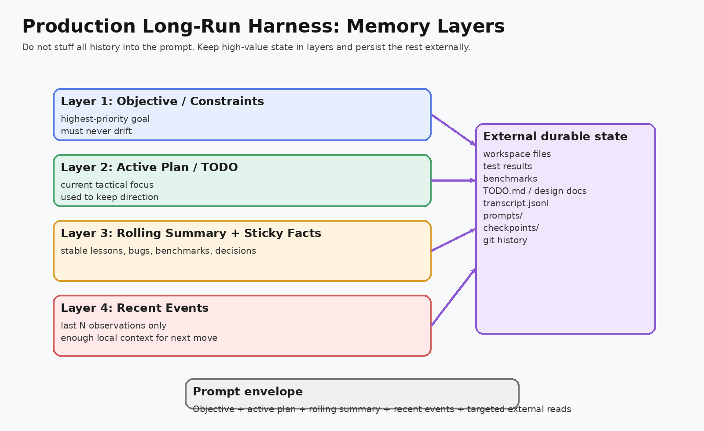

# Go Production Long-Run Harness

这是一个 **Go 实现的长程 agent harness**，目标不是“让模型回答一次”，而是把模型放进一个 **可恢复、可审计、可运维、可接任意模型 API 的工程控制回路**。

它面向的不是教学玩具场景，而是这类真实需求：

- 一次任务持续运行几十分钟到数小时。
- 中间要反复读写文件、执行命令、跑测试、做 review、压缩上下文。
- 进程崩了以后要能从 checkpoint 恢复，而不是从头再来。
- 需要留下完整的状态、转录、prompt 审计和运行报告。
- 模型端点不能写死为某一家，至少要支持 OpenAI-compatible 和通用 JSON REST。


## 这版为什么不是 toy

这个版本相对“教学脚手架”做了真正的工程化增强：

- **严格动作协议**：模型必须输出结构化 JSON；actor 决策会做严格解析和校验。
- **会话与恢复**：每步写 `state.json`、`checkpoints/`、`transcript.jsonl`，支持 `-resume-run`。
- **审计**：可落盘 prompt / response / raw provider payload。
- **结构化日志**：stdout 和 `run.log` 同时写，支持 JSON logs。
- **可观测性**：内置 `/healthz`、`/debug/vars`，可选 pprof。
- **Provider 抽象**：`openai_compatible`、`generic_json`、`mock` 已实现。
- **重试与退避**：Provider 层内置 retry/backoff/jitter。
- **工具沙箱**：文件路径限定在 workspace；shell 工具使用 `argv` 而不是自由 shell string；支持 allowlist / denylist。
- **分层记忆**：目标、当前计划、滚动摘要、最近事件分层管理，不把全部历史塞进 prompt。
- **review + summarize 闭环**：不是单模型盲跑，而是 actor / reviewer / summarizer 协作。

## 目录结构

```text
cmd/harness/                 CLI 入口
internal/config/            配置加载、默认值、校验、环境变量展开
internal/harness/           主控制循环、状态、session、prompt、协议
internal/provider/          Provider 接口与实现
internal/tools/             文件/命令/Git/HTTP/benchmark 工具
internal/observability/     日志与 metrics server
internal/util/              原子写文件、路径安全
examples/                   示例配置与任务
docs/                       架构、运维、学习材料
deploy/                     Docker 部署样例
```

## 快速开始

### 1. 编译

```bash
go build ./cmd/harness
```

### 2. 跑 mock 演示

```bash
go run ./cmd/harness \
  -config examples/config.mock.json \
  -task examples/tasks/mock_demo.md
```

输出会告诉你本次 run 的目录，例如：

```text
run_dir=/path/to/runs/demo-20260424-120000-abc123
status=completed
```

### 3. 恢复一个中断 run

```bash
go run ./cmd/harness \
  -config examples/config.openai-compatible.json \
  -resume-run prod-20260424-120000-abc123
```

## 接入真实模型

### OpenAI-compatible

编辑 `examples/config.openai-compatible.json`，设置：

```bash
export MODEL_BASE_URL=...
export MODEL_NAME=...
export REVIEW_MODEL_NAME=...
export MODEL_API_KEY=...
```

然后运行：

```bash
go run ./cmd/harness \
  -config examples/config.openai-compatible.json \
  -task examples/tasks/build_simple_cli.md
```

### 任意 JSON REST API

如果你的模型 API 不是 OpenAI 协议，但还是 JSON over HTTP，可以用 `generic_json`：

- `input_mode=messages` 时把标准 `messages` 放到你指定的 JSON 路径。
- `input_mode=prompt` 时先把消息拼成单字符串，再写到你指定路径。
- `response_text_path` 决定从响应 JSON 哪个字段取文本。
- `json_mode_field_path` / `json_mode_value` 用来告诉对方接口“请返回 JSON”。

样例见 `examples/config.generic-json.json`。

## 运行时产物

每个 run 都会创建独立目录：

```text
runs/<run-id>/
  RUN_REPORT.md
  run.log
  state.json
  transcript.jsonl
  prompts/
  artifacts/
  audit/
  checkpoints/
```

这些文件各自的作用：

- `state.json`：当前最新状态，恢复时以它为准。
- `checkpoints/`：每一步的状态快照。
- `transcript.jsonl`：完整事件流水。
- `prompts/`：每一步的 prompt 与模型响应审计。
- `artifacts/`：每次工具调用的结构化结果。
- `RUN_REPORT.md`：最终面向人阅读的摘要报告。

## 控制循环


单步循环是：

1. actor 根据目标、计划、摘要、最近事件生成严格 JSON 决策。
2. harness 校验动作协议，执行工具。
3. 把结果转成 observation 记入 transcript。
4. reviewer 定期做自评和重排优先级。
5. summarizer 在超预算或定时条件下压缩上下文。
6. 每步结束写 checkpoint，形成安全恢复边界。

## 记忆模型



长期能力的关键不是无限上下文，而是：

- prompt 只保留“当前最有用”的那小部分状态；
- 其余事实放在 workspace 和 run artifacts；
- 需要时再读回来。

## 关键源码入口

- `internal/harness/engine.go`：主循环。
- `internal/harness/session.go`：state / checkpoint / transcript / prompt 审计落盘。
- `internal/provider/openai_compatible.go`：OpenAI-compatible 接入。
- `internal/provider/generic_json.go`：通用 JSON API 接入。
- `internal/tools/shell.go`：受控命令执行。
- `internal/tools/files.go`：workspace 文件工具。

## 安全边界

这个工程已经做了不少硬约束，但如果你要直接上生产，还应结合你自己的环境再补几层：

- 把 shell 工具放进容器、nsjail、Firecracker 或 Kubernetes Job 沙箱。
- 用专门的 secrets 管理系统，而不是把所有密钥暴露给 harness 进程。
- 对 Git、HTTP、Benchmark 等工具做更细粒度的 RBAC / allowlist。
- 按组织要求补充审计落库、告警、SLO 和成本限额。

这份代码已经是 **production-oriented baseline**，不是 toy；但“能进你们公司的生产环境”还要结合你的隔离、合规和运维体系再落一层。

## 测试

```bash
go test ./...
```

## 部署

见 `deploy/Dockerfile`。

## 学习路径

建议按这个顺序读：

1. `docs/01-system-architecture.md`
2. `docs/02-state-machine-and-recovery.md`
3. `docs/03-provider-abstraction.md`
4. `docs/04-tool-sandbox-and-safety.md`
5. `docs/05-operations-and-learning-guide.md`
6. `docs/06-toy-to-production-gap.md`
