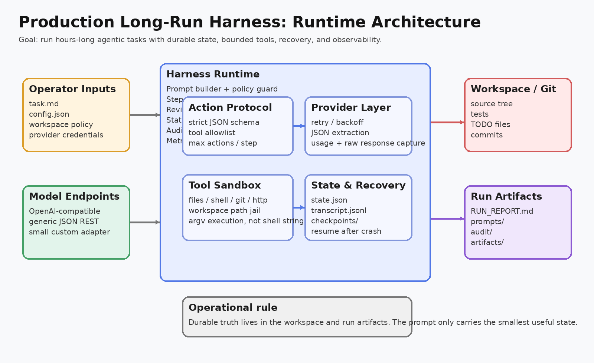

# 01. System Architecture

## 核心判断

长程 harness 的本体不是“调用 LLM API”，而是一个 **runtime**：

- 负责把 task + memory + recent observations 组装成 prompt。
- 负责把模型输出变成 **严格可执行动作**。
- 负责控制工具调用、保存状态、管理恢复点。
- 负责在长期运行中持续做 review、summary、压缩上下文。

所以这个工程的主角其实不是 provider，而是 `internal/harness/engine.go`。

## 模块划分

### 1. Operator Inputs

输入面包括：

- 任务文件 `task.md`
- 运行配置 `config.json`
- workspace 根目录
- provider 凭据和 endpoint

这层是 **控制面**，决定本次 run 的约束边界。

### 2. Harness Runtime

运行时内部拆成几块：

- **Prompt builder + policy guard**
  - 负责拼 prompt
  - 负责告诉模型可用工具与动作协议
  - 负责在执行前做 schema 校验

- **Step controller + timeouts**
  - 负责每步 timeout
  - 负责 wall-clock deadline
  - 负责 max failures / max steps

- **Reviewer + summarizer loop**
  - 周期性自评，避免 drift
  - 周期性摘要，避免上下文爆炸

- **State store + checkpoints**
  - 每步持久化最新状态
  - 每步生成可恢复快照

- **Audit log + structured events**
  - 记录 actor 决策、tool 输出、review、summary、错误

- **Metrics / health**
  - 提供 `/healthz`
  - 提供 `expvar`
  - 可选 `pprof`

### 3. Provider Layer

provider 层的职责不是业务逻辑，而是：

- 请求构造
- 认证头注入
- 超时
- 重试、退避、抖动
- 响应解析
- 提取文本
- 留 raw response 审计材料

这也是为什么 provider 抽象要独立于 harness 控制循环。

### 4. Tool Sandbox

tool 层是“让模型能真正改世界”的那层，同时也是最大风险面。

本工程里已经做了几层约束：

- 文件路径必须落在 workspace 内。
- shell 工具使用 `argv`，避免自由 shell string。
- shell 命令支持 allowlist / denylist。
- benchmark 只能运行预配脚本名字，不能自由发明命令。

### 5. Workspace / Git

长期任务里，**工作区本身就是记忆的一部分**：

- 代码
- 测试
- TODO 文档
- benchmark 输出
- Git 历史

这部分状态不需要全塞到 prompt，只需要在必要时读回来。

### 6. Run Artifacts

run artifacts 是另一部分外部状态：

- `RUN_REPORT.md`
- `state.json`
- `transcript.jsonl`
- `prompts/`
- `checkpoints/`
- `artifacts/`

这里的价值在于：

- 便于人类审计
- 便于 crash recovery
- 便于做后验分析
- 便于把一次 run 当成工程记录，而不是聊天记录

## 为什么这套划分适合生产

生产级 harness 最怕这几件事：

- 模型 drift 后没人发现。
- 工具调用不可控。
- 进程一挂所有状态丢光。
- 长跑结束后只剩一句“我做完了”，没有证据。
- 接入新模型时要重写全部主流程。

这个架构正好分别用 reviewer、sandbox、checkpoint、audit、provider abstraction 去对应解决。

## 你读代码时应该抓住的主线

先看 `engine.go`，理解 **一轮 step 到底做了什么**；
再看 `session.go`，理解 **为什么 run 可以恢复、为什么有审计**；
然后看 `provider/` 和 `tools/`，理解 **runtime 是如何向外接模型、向内接工具的**。
