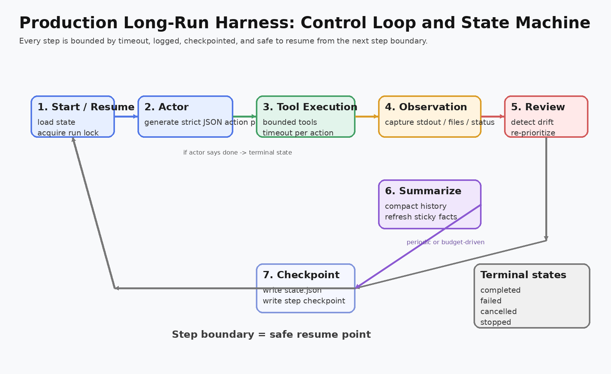

# 02. Control Loop, State Machine, and Recovery

## 单步状态机

每一步的生命周期大致是：

1. **Start / Resume**
   - 读 `state.json`
   - 获取 run lock
   - 决定从 `state.Step + 1` 继续

2. **Actor**
   - 给模型发送：objective、plan、todo、rolling summary、recent events、tool catalog
   - 要求只返回严格 JSON

3. **Tool Execution**
   - 按顺序执行动作
   - 每个动作可有自己的 `timeout_seconds`
   - 每个动作结果都会写 artifact

4. **Observation**
   - 把工具结果转成结构化 observation
   - 记进 transcript

5. **Review**
   - 每 `review.every_n_steps` 做一次
   - 查缺口、风险、下一优先级

6. **Summarize**
   - 每 `memory.summarize_every_n_steps` 或 token 预算超限时触发
   - 把长历史压缩成未来可继续工作的摘要

7. **Checkpoint**
   - 写 `state.json`
   - 写 `checkpoints/state-step-XXXX.json`

## 为什么恢复点放在 step 边界

恢复时最安全的粒度不是“动作中间”，而是 **动作全部完成后的 step 边界**。

原因很简单：

- 动作中间态通常不可重放。
- 某些命令可能已经部分改动了工作区。
- shell / git / benchmark 这类副作用动作很难做到 exactly-once。

所以这个工程采用的策略是：

- 一个 step 内尽量少动作。
- 动作做完立即记录 observation。
- step 结束后写 checkpoint。
- 恢复时从下一步开始。

这比追求“每个系统调用都可恢复”要现实得多。

## 失败处理

系统有几层停止条件：

- `max_steps`
- `max_wall_clock_minutes`
- `max_consecutive_failures`
- 外部信号 `SIGINT` / `SIGTERM`
- actor 明确 `done=true`

对应状态大致有：

- `completed`
- `failed`
- `cancelled`
- `stopped`

## run lock 的作用

`session.go` 在 run 目录里创建 `.lock`，目的很直接：

- 防止同一个 run 被两个进程同时 resume
- 防止 checkpoint 互相覆盖
- 防止 transcript 顺序损坏

这不是分布式锁，只是本机进程级别的互斥，但对于单 worker harness 已经够实用。

## transcript 与 checkpoint 各自解决什么问题

### transcript.jsonl

解决的是 **事件可追溯**：

- 某步模型说了什么
- 执行了什么 tool
- tool 返回了什么
- 什么时候做了 review / summary

### checkpoints/

解决的是 **恢复与调试**：

- 第 17 步崩了，恢复时从第 18 步继续
- 第 43 步开始 drift，可以回看第 42 步状态

## 实际生产使用建议

- 不要把 `review.every_n_steps` 设太大，否则 drift 会更难纠正。
- 不要把 `max_actions_per_step` 设太大，否则单步副作用太重，不利于恢复。
- 对昂贵任务建议把 `persist_prompts` 和 `persist_provider_io` 打开，便于后验分析。
- 对高风险工具务必再加外部沙箱，而不是只靠进程内限制。
